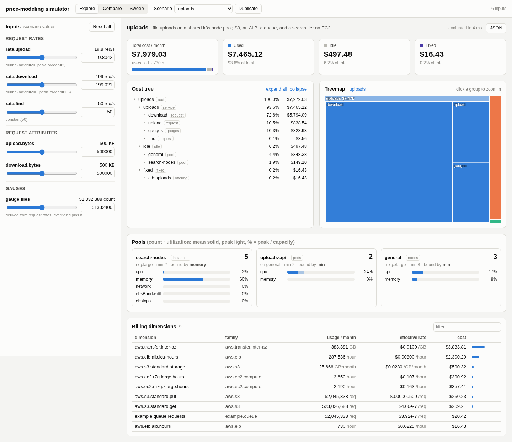

# pricesim UI

A browser simulator for pricesim scenarios: the visual counterpart of `pm eval` and `pm sweep`. Hand it
one or more `Scenario` objects and it shows:

- **Explore:** the evaluated result (total, used, idle, fixed), the cost tree (a collapsible outline and a
  zoomable treemap), billing dimensions, pool sizing (count, binding resource, utilization), tenants, and, with a
  price book, revenue, margin, and margin per meter and per customer. Inputs generated from the workload
  (request rates, request attributes, gauge levels, params) update the result as you drag or type.
- **Compare:** several scenarios side by side, each with its current overrides: totals, margin, and cost by
  dimension family.
- **Sweep:** one variable over a range (linear or log), charting total cost, used / idle / fixed, the top
  dimensions, revenue and margin, and pool counts on a separate chart. Exports CSV in the `pm sweep --csv`
  format.

It does not author models: scenarios come from TypeScript, as for the CLI.



## Running the dev app

```sh
cd ui
pnpm install
pnpm dev          # http://localhost:5173: the examples/ scenarios
pnpm typecheck
pnpm build        # static site in ui/dist (pnpm preview serves it)
```

The dev app ([`dev/main.ts`](dev/main.ts)) registers the guide example (`uploads`, `uploads-shared`,
`uploads-shared-priced`), `orders-platform` and the 200-tenant `multi-tenant` example, and evaluates in a Web
Worker. Append `?main-thread` to the URL to evaluate on the main thread instead.

The library is imported from source (`../src`), so the UI always runs against the current code. Vite aliases
mirror the library's package `exports` (`pricesim`, `pricesim/model`, `pricesim/aws`, …), so
model files written for the CLI load unchanged. The UI package installs its own copy of `mathjs` (the library's
only dependency), so the repository root needs no `pnpm install`.

## Mounting with your own scenarios

```ts
import { mountSimulator } from 'pricesim-ui'
import { scenarios } from './scenarios.ts' // Record<string, Scenario>

const sim = mountSimulator(document.getElementById('app')!, { scenarios, title: 'My cost model' })
sim.update({ scenarios: { ...scenarios, next } }) // overrides persist for names that persist
sim.unmount()
```

`Simulator` is also exported as a Preact component. Styles are scoped under `.pm-sim` and follow
`prefers-color-scheme` (or `data-theme="light" | "dark"` on `<html>`).

**Evaluating in a worker.** Scenarios hold closures (series, request handlers), so they cannot be posted to a
worker. The worker imports the same scenarios module instead, and the UI sends it a scenario name and the
overrides:

```ts
// scenarios.worker.ts
import { serveScenarios } from 'pricesim-ui/worker'
import { scenarios } from './scenarios.ts'
serveScenarios(scenarios)

// main.ts
mountSimulator(el, {
  scenarios,
  worker: new Worker(new URL('./scenarios.worker.ts', import.meta.url), { type: 'module' }),
})
```

Use a worker once an evaluation takes more than about 50 ms. The 200-tenant example takes about 3 s per
evaluation. On the main thread, evaluations are debounced (120 ms), and the page freezes while each one runs.
In a worker the page stays responsive. Requests run one at a time, and a newer slider value replaces one still
waiting, so fast drags don't queue up work.

Until the package is published or linked, import from source: `pricesim-ui` →
`<path>/ui/src/index.ts`, `pricesim-ui/worker` → `<path>/ui/src/worker.ts`. Use the same Vite aliases
for `pricesim` as [`vite.config.ts`](vite.config.ts).

## Inputs

Inputs use the sweep variables of `withOverrides` (DESIGN.md §8), in base units:

| key                | control                                                           |
| ------------------ | ----------------------------------------------------------------- |
| `rate.<request>`   | mean rate in req/s; log slider, 1/100× to 100× the scenario value |
| `<request>.<attr>` | attribute value; log slider (distribution attributes: their mean) |
| `gauge.<name>`     | gauge level; log slider                                           |
| `<param>`          | params found in the model's expressions; linear, 0 to 3×          |

The text box takes exact values in base units (`500000`) or a quantity (`500 KB`, `20 req/s`).

`withOverrides` supports single-workload scenarios only. For multi-tenant scenarios the UI applies it to each
tenant's workload. It exposes a scale factor per request type for all tenants (`*::rate.<request>`), per-tenant
inputs (`<tenant>::rate.upload`, and so on, picked with the tenant selector), and params that apply to every
tenant.

## Layout

```
ui/
  index.html, dev/        dev app: example scenarios, worker entry
  src/index.ts            public API: mountSimulator, Simulator, applyOverrides, discoverInputs, run
  src/worker.ts           serveScenarios (worker side)
  src/model/              non-visual logic
    inputs.ts             input discovery; tenant-aware applyOverrides on top of withOverrides
    run.ts                timed evaluation; main-thread and worker evaluators; useEvaluation; runSweep
    format.ts, colors.ts, treemap.ts (squarified layout)
  src/components/         Preact views: Simulator, Explore, Controls, Summary, CostTree, Treemap,
                          Details (dimensions, pools, tenants, revenue), Compare, Sweep, LineChart
  screenshots/
```

**Libraries.** The UI uses Preact (about 4 KB), because a host page that mounts the simulator shouldn't need a
particular React version. It uses [uPlot](https://github.com/leeoniya/uPlot) (about 50 KB, no dependencies) for
the sweep charts: it is fast, has log scales, and draws a hover crosshair with legend values. The treemap and
the stacked bars are plain SVG and HTML.

## Known limitations

- **Plans.** Price-book plan options can't be changed from the UI; each tenant keeps the plan from its
  scenario.
- **Derived gauges.** A gauge derived from rates (e.g. `files` = 30 days of uploads) shows its scenario value
  in the controls. The result follows rate overrides, but the gauge's control doesn't show the new level.
  Overriding the gauge pins it.
- **Params.** The UI finds params in request and gauge expressions only, not in pool capacities. It can't
  recover a param's unit from its default, so params show in base units.
- **Sweeps.** A sweep runs one variable at a time and runs points sequentially. `pm sweep` also takes grids.
- **Persistence.** State isn't saved: overrides and duplicates reset on reload.
- **Tests.** There are no UI tests. `src/model/inputs.ts` is the part that most needs them.

## What's next

- Persist state in the URL hash (scenario, overrides, tab), so a link reproduces a view.
- Switch price-book plans per customer, and add a unit-cost panel (`unitCosts`) for single-workload scenarios.
- Show the closed form (`closedForm`) beside the sweep: the formula and its linear coefficients.
- Package it: a library build (`vite build --lib`) with `pricesim` as a peer dependency, `exports` for
  `.` and `./worker`, and a `pm ui <model.ts>` CLI command that serves a model file's exports.
- Vitest tests for input discovery and `applyOverrides`: tenant scaling, and unknown keys.
